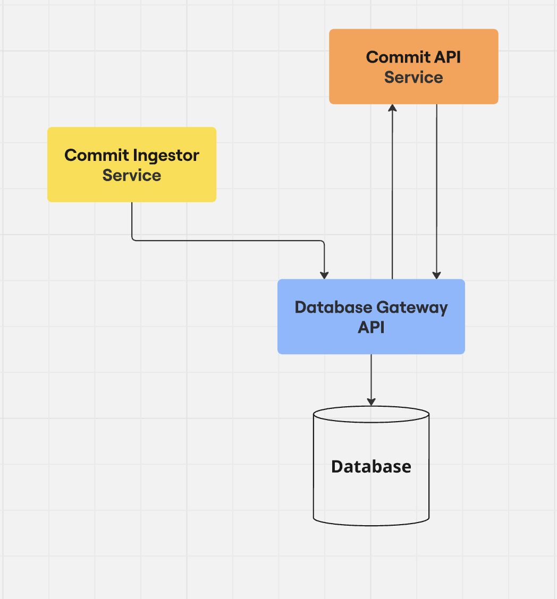

## 🐞 Debugging Approach & Tools
To debug this mini-project, I followed several strategies:

- Logging: I added logging throughout the code where necessary. In case of exceptions, I used `exc_info=True` to capture the full traceback.
- Testing: I wrote a few integration tests early in development to help catch bugs as changes were made. I used `pytest` as the testing framework. All tests in the repository are compatible with it. The command I used is:

```bash
$ pytest -s .
``` 

- Database Inspection: I manually inspected the MySQL database using the CLI to verify that data was being inserted as expected. For this, I installed `default-mysql-server` inside the container.
- API Testing: I used `Postman` and the generated `OpenAPI` schema for manually testing the API endpoints.


## 🧪 Testing Approach
I followed a layered testing strategy to test this mini-project:

- Unit Tests: These tests focused on validating individual logic components in isolation.
- Integration Tests: These covered the interaction between services and the database. Having a few integration tests ready early in development was helpful as they served as a quick way to validate the app after changes.
- Testable Design: I tried to design the components to be easily testable by using dependency injection wherever possible. I also aimed to keep functions and classes small and focused, which made them easier to write tests for.
- Mocking: I used `pytest-mock` to mock dependencies during unit tests. It was also useful for integration tests, for example, to avoid making real requests to the GitHub API.
- FastAPI Dependency Overrides: I used FastAPI’s dependency override to swap out real dependencies with mocks or test configurations during testing.
- Settings Handling: I tried to ensure that the settings module is accessed only through FastAPI routes and is passed as a dependency, which makes it easier to override in tests.
- Pytest Fixtures: I made use of pytest fixtures to handle setup and teardown, as well as to inject test-specific data or mocks.
- Isolation: All tests are written to run in isolation to avoid side effects or interference between tests.


## 🏗️ Microservices Architecture (Single DB)
If the mini-project were to evolve into a microservices architecture with a single database, I would propose having this Architecture:

<div style="text-align: center;">
  
</div>

1. **Database Gateway Service, the sole interface to the database.**

- Maintains exclusive knowledge of database schema.
- Handles all read/write operations.
- Contains all SQL/query logic.
- Manages database migrations.

2. **Commit API Service.**

- Provides commit/author information.
- Communicates exclusively with Database Gateway.
- No direct database knowledge.

3. **Commit Ingestor Service.**

- Scheduled data collection (maybe with Celery or something similar).
- Fetches commits from GitHub API (or GitLab/Bitbucket).
- Processes and normalizes data.
- Submits data to the Database Gateway service.
- Also no direct database knowledge.

#### Key Architectural Benefits:
- Clean Separation of Concerns.
- Easy database technology swaps if needed.
- Easy database migration management.
- Scalability.
- Clear service boundaries.


## 🌐 Switching from DB to External API
If we needed to replace the database with an external API for storing and retrieving commits, the solution could be adapted with minimal changes:

- Instead of using the `database_adapter`, we could plug in the `api_adapter` that communicates with the external API.
- This flexibility is possible because all database operations were abstracted into a `storage` adapter. By isolating storage logic behind an interface, we made it easy to swap solutions, whether it's a direct DB connection or an API.
- Additionally, the storage layer consistently returns Pydantic models, so the expected return structure remains the same regardless of which adapter is used. This makes it easy to implement, also it makes it easy to test new adapters without affecting the rest of the application.